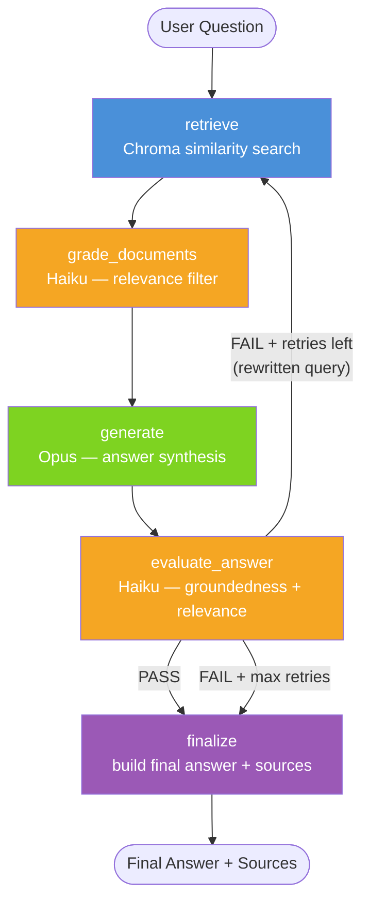

# RAG Pipeline — LangGraph + Claude

A production-quality Retrieval-Augmented Generation (RAG) pipeline built with LangGraph, ChromaDB, and Anthropic Claude models. Supports PDF, DOCX, and plain text knowledge bases.

## Architecture



## Project Structure

```
RAG_pipeline/
├── ingest.py          # Parse documents → Markdown → chunk → embed → Chroma
├── graph.py           # LangGraph StateGraph definition + conditional routing
├── state.py           # RAGState TypedDict (shared across all nodes)
├── config.py          # All configurable settings (reads from .env)
├── main.py            # CLI entrypoint (single query + interactive mode)
├── nodes/
│   ├── retrieve.py    # Vector search node
│   ├── grade.py       # LLM relevance grading node (Haiku)
│   ├── generate.py    # Answer generation node (Opus)
│   ├── evaluate.py    # Answer quality evaluation node (Haiku)
│   └── finalize.py    # Package final answer + source citations
├── parsed/            # Auto-created: converted Markdown files
├── chroma_db/         # Auto-created: local Chroma vector store
├── .env.example       # Environment variable template
└── requirements.txt
```

## Quick Start

### 1. Install dependencies

```bash
pip install -r requirements.txt
```

### 2. Configure

```bash
cp .env.example .env
# Edit .env and set your ANTHROPIC_API_KEY
```

### 3. Ingest your knowledge base

```bash
# Single file
python ingest.py TCS_Network_KB_SOPs.docx

# Entire directory
python ingest.py ./docs/
```

This will:
- Parse the document to Markdown (saved in `parsed/`)
- Split into heading-aware chunks
- Embed with `all-MiniLM-L6-v2` (runs locally)
- Store in Chroma (`chroma_db/`)

### 4. Ask questions

```bash
# Single question
python main.py "What is the escalation procedure for P1 network incidents?"

# Verbose (shows all node logs)
python main.py --verbose "How do I configure BGP failover?"

# Interactive mode
python main.py --interactive

# JSON output (for programmatic use)
python main.py --json "What are the SLA targets for network uptime?"
```

## Pipeline Design Decisions

### Model allocation

| Node | Model | Reason |
|------|-------|--------|
| `grade_documents` | `claude-haiku-4-5` | Binary YES/NO relevance — cheap and fast |
| `generate` | `claude-opus-4-8` | Answer quality is user-facing — strongest model |
| `evaluate_answer` | `claude-haiku-4-5` | Structured JSON verdict — Haiku handles this well |

### Chunking strategy

`MarkdownHeaderTextSplitter` splits first on `#`/`##`/`###`/`####` boundaries, ensuring chunks never straddle section boundaries. `RecursiveCharacterTextSplitter` then sub-splits any oversized sections. Each chunk carries metadata: `source`, `section_heading`, `chunk_id`.

### Retry loop

`evaluate_answer` checks two properties:
1. **Groundedness** — every claim is supported by the retrieved context
2. **Relevance** — the answer addresses the question

On `FAIL`, it rewrites the query to guide the next retrieval round. The loop repeats up to `MAX_RETRIES` (default: 2) times before `finalize` delivers a best-effort answer with a warning.

### Parsing

| Format | Library | Why |
|--------|---------|-----|
| PDF | `pymupdf4llm` | Native Markdown output — headings, tables, lists preserved |
| DOCX | `python-docx` | Maps paragraph styles to `#`/`##`/`###` heading levels |
| TXT/MD | built-in | No conversion needed |

## Configuration

All settings are in `.env` (see `.env.example`). Key parameters:

| Variable | Default | Description |
|----------|---------|-------------|
| `ANTHROPIC_API_KEY` | — | **Required** |
| `GENERATOR_MODEL` | `claude-opus-4-8` | Model for answer generation |
| `GRADER_MODEL` | `claude-haiku-4-5` | Model for grading + evaluation |
| `TOP_K` | `5` | Number of chunks to retrieve |
| `MAX_RETRIES` | `2` | Max retry loops on evaluation FAIL |
| `CHUNK_SIZE` | `800` | Max characters per chunk |
| `CHUNK_OVERLAP` | `100` | Character overlap between chunks |
