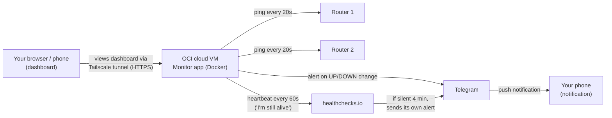

# Router Reachability Monitor

Built with Claude Code. Monitoring automation, no LLM.

External reachability monitor for two internet edge routers (site LI-MDF). Pings both routers on an interval, runs an UP/DOWN state machine with debounce, sends multi-channel alerts (Telegram text, Telegram voice call, WhatsApp, ntfy), and serves a live NOC-style dashboard (green = UP, red = DOWN).

## How it works



The VM is the only thing doing work on a schedule — everything else reacts when it hears from the VM. It runs 24/7 in Oracle's free tier, pings both routers directly over the public internet, and has no open port of its own: the dashboard is reachable only through a private Tailscale tunnel. healthchecks.io is a separate, unrelated free service that only watches whether the VM itself is still checking in — if it goes silent for 4 minutes, healthchecks.io raises its own alert independently of the app.

## Features

- ICMP + TCP probing with a canary check (1.1.1.1 / 8.8.8.8) so a local internet outage isn't mistaken for a router outage.
- Pure, unit-tested UP/DOWN state machine with configurable fail/recover thresholds and flap detection.
- Both routers down at once is treated as `SITE_ISOLATED` (critical severity, immediate voice call).
- Alerting via Telegram (text + inline ACK button + bot commands), CallMeBot voice call, WhatsApp, and ntfy — each channel independent, so one failing never blocks the others.
- Maintenance mode (mute a target for a time window) and a daily 09:00 IST summary.
- Dead-man's switch via healthchecks.io so the monitor is alerted if it stops running.
- Live dashboard over WebSocket (polling fallback), dark theme, Chart.js history graphs.
- SQLite storage, single Docker image (multi-arch: amd64 + arm64), deployed behind Tailscale Funnel (HTTPS) with no ports exposed on the host.

## Stack

Python 3.11+, asyncio, FastAPI + Uvicorn, WebSocket, SQLite (`aiosqlite`), `icmplib`, `httpx`, `pydantic-settings`, Jinja2 + vanilla JS + Chart.js. Tests: pytest + pytest-asyncio.

## Running locally

```bash
python -m venv .venv && .venv\Scripts\activate      # Windows
pip install -r requirements.txt
cp .env.example .env                                 # then fill secrets
uvicorn app.main:app --host 0.0.0.0 --port 8080
pytest -q
```

## Design notes

See `PLAN.md` for the full design and `CLAUDE.md` for the build/testing discipline followed throughout — every phase was proven with a real command and its output, logged in `docs/progress.md`.

---

Part of the `llm-engineering-journey` portfolio: GenAI/LLM projects built with Claude Code, plus fundamentals built independently. Background: 17 years in networking.

Still learning. Still building.
