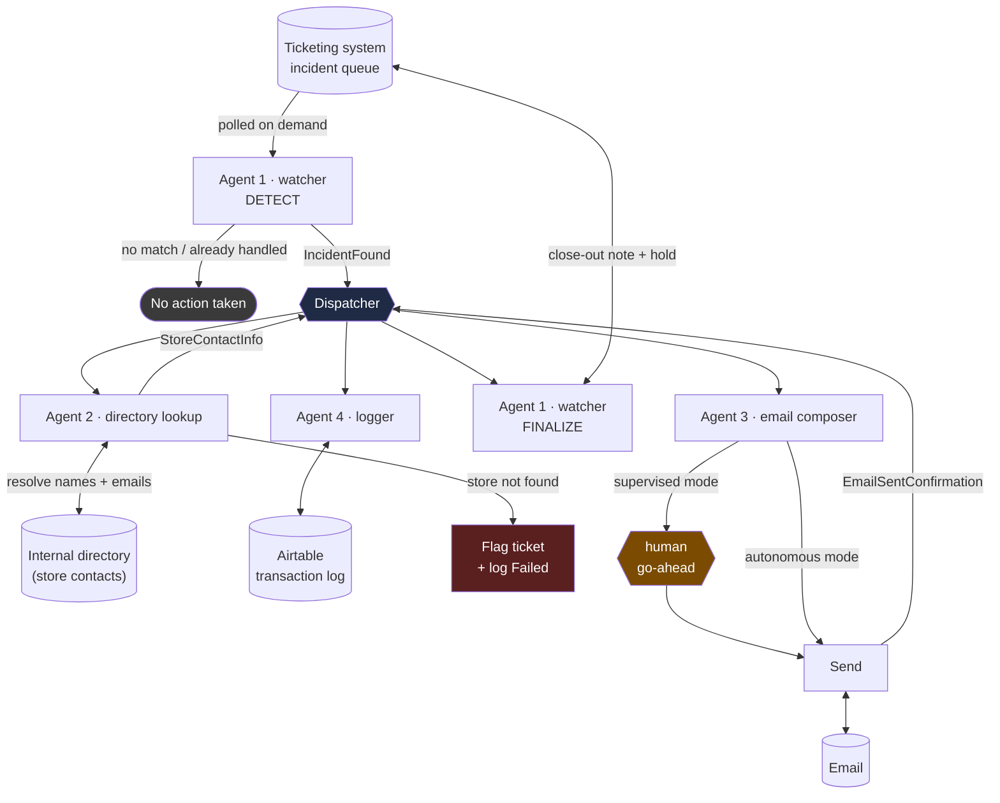

# Store-Down Incident Automation

### A multi-agent system that closes the loop on a real NOC runbook — detection to resolution, no manual lookup in between

*Note: this write-up uses placeholder names, emails, store codes, ticket numbers, and system IDs throughout — the real client/store data stays where it belongs. The architecture, the design decisions, and the debugging stories are all real.*

---

## The problem

At my day job, one specific alert type generates a steady trickle of tickets: a store's network monitoring flags it as unreachable — "No ping reply for `<store code>`." Every time one lands, a human has to notice it, figure out which store it is, dig up that store's manager and regional lead from an internal directory, write and send a notification email, come back and paste that email into the ticket, put the ticket on hold, and log the whole thing for tracking. Same steps, every time, done by hand.

I wanted to see if I could build a multi-agent system — real agents, real typed contracts between them, not a single mega-prompt — that does the entire runbook end to end, with a human still firmly in control of the one step that actually matters (whether an email goes out to real people).

## Architecture

Five roles, each owning exactly one system — same discipline I'd apply to network appliances: one box, one job.

| Agent | Owns | Job |
|---|---|---|
| **Dispatcher** | orchestration | Sequences the four agents, validates every hand-off against a typed schema, tracks idempotency and the kill switch |
| **Agent 1 — watcher** | ticketing system | Detects matching tickets; later closes them out once the email is confirmed sent |
| **Agent 2 — directory lookup** | internal store directory | Resolves the store's shared mailbox plus the manager's and regional lead's names *and real personal emails* |
| **Agent 3 — email composer** | email | Composes and sends the notification — gated by a mode a human controls |
| **Agent 4 — logger** | Airtable | One row per incident, updated as the pipeline progresses — doubles as the audit trail |

**No API access exists for any of the three internal systems** — everything is real browser automation against the actual web UI, driving an already-authenticated session. That constraint shaped the whole design: every hand-off between agents is a typed Pydantic schema, not free text, so a malformed result gets caught before it can propagate a wrong store or a wrong recipient downstream.

## Three things I got wrong before I got them right

This is the part I actually want to write up, because catching your own mistakes with evidence is the whole job.

**1. I assumed the directory site couldn't reveal personal emails — it could, I just wasn't hovering.** The internal directory page only *displays* names next to each role, so my first design had a separate agent resolve those names to emails via the email platform's own address-book search. I built that, tested it, and got "no results found" for real people with confirmed working addresses. Before ripping the design apart, I actually hovered over a person's photo on the directory page itself — and a contact card popped up with their real email. Confirmed against four different real people. The lesson wasn't "the address-book search is broken," it turned out — it was "read the page more carefully before designing around what it doesn't have."

**2. That same address-book search "failure"? I'd tested it on the wrong account.** This browser had two Microsoft accounts signed in — my actual work account, and a leftover session from a different organization entirely. My directory-search test had silently run against the wrong tenant. Once I caught that and retested on the correct account, the search worked fine the whole time. I now have a hard rule baked into the agent: verify which account is active before doing anything, every single time — not just once.

**3. The directory page will show you a *literal placeholder* as if it were a name.** For one role with nobody currently assigned, the page displayed the string "No Match" in the exact spot where a person's name normally goes — same font, same layout. An agent that just reads whatever text is there would report "No Match" as somebody's actual name and try to email it. Now the agent explicitly checks for that string and treats it as "nobody assigned," not as data.

None of these were caught by writing better prompts. They were caught by actually running the thing against real data and looking hard at what came back — which is, I think, the actual skill this project was practice for.

## Design decisions that mattered

- **Nothing is ever guessed.** Every "what if the data's missing or weird" case (an unassigned role, a store not in the directory, an ambiguous match) gets reported honestly rather than papered over with an assumption.
- **The riskiest action is the most controlled.** A `send_mode` setting decides whether every email needs a human's explicit go-ahead (`supervised`, the default) or goes automatically (`autonomous`, switched on only once the pipeline's proven itself) — plus a separate kill switch that can halt everything, instantly.
- **The system resumes, it doesn't repeat.** If it's interrupted mid-incident, the Airtable log tells it exactly which step to resume at — it will never re-send an email or reprocess a ticket it already closed.
- **Every design correction is logged with what actually happened, not just the fix** — the debugging stories above all came out of a running build log I kept the whole way through, timestamped, append-only, never edited after the fact.

## Tech stack

- **Orchestration:** a deterministic coordinator (not a free-form agent chat) sequencing four scoped subagents
- **Contracts:** Pydantic models for every inter-agent hand-off, validated via a small CLI wrapper before anything downstream trusts them
- **Browser automation:** driving an already-authenticated Chrome session for the three internal systems with no API access
- **Storage/logging:** Airtable, upserted per-incident, doubling as both pipeline state and the audit trail
- **Framework:** Claude Code — subagents, a skill for orchestration, project-level config for the kill switch and send mode

## Status

Built and validated in phases — detection, directory lookup, email composition (validated up to, not including, an actual send), ticket close-out and logging, and the orchestrator tying it together — each one checked against real data before moving to the next. Live end-to-end operation, with a human approving the first real sends, is next.

---

Part of the `llm-engineering-journey` portfolio — documenting a hands-on transition from 16+ years of enterprise network engineering into AI/ML engineering.
